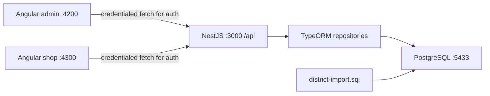

# Architecture and terminology

## Components

Only authentication is currently connected from the browser to the API. Other frontend pages mostly render inline sample data. A working backend endpoint does not mean its corresponding frontend page consumes it.

## Repository map

| Path | Responsibility |
| --- | --- |
| apps/backend/src/main.ts | HTTP startup, CORS, validation, API prefix, Swagger |
| apps/backend/src/app.module.ts | Configuration, database connection, feature registration |
| apps/backend/src/modules | Auth, users, vendors, catalog, health |
| apps/admin/src/app | Protected administration shell, auth client, demonstration pages |
| apps/shop/src/app | Customer shell, account forms, cart scaffold, demonstration pages |
| docker-compose.yml | Local PostgreSQL 16 Alpine and pgAdmin, persistent database volume |
| district-import.sql | Transactional district seed/import against existing states |
| docs | Human guides and generated file references |
| scripts/dev.mjs | Runs a root development command together with the docs watcher |
| scripts/docs.mjs | Reference generation, guide freshness checks, watcher |
| .github/workflows/docs.yml | Documentation validation on pushes and pull requests |

## Vocabulary

An **entity** maps a TypeScript class to a database table. A **repository** reads and writes one entity type. A **DTO** defines the shape and validation rules for an incoming request. A **service** implements reusable behavior; a **controller** connects HTTP methods and paths to that behavior. A **guard** authorizes a request before a controller runs. **Middleware** runs earlier and performs auth request checks and rate limiting.

An Angular **component** owns a screen or layout. A **signal** stores reactive state. A **store** groups state and operations. A frontend route guard controls navigation; only the backend can enforce access to data.

## Request lifecycle

For a login request: the browser sends JSON and a custom header with credentials enabled; CORS limits participating origins; authentication middleware checks the request and increments its rate-limit counter; the global validation pipe normalizes and validates the DTO; the controller calls the service; the service checks the password and stores a session hash; the controller sets a cookie and returns a public user object.

For protected reads: the auth guard extracts the cookie, verifies the server-side session and expiry, and reloads the user. The admin guard then checks the current database role. A controller guard does not rely on a role asserted by the browser.

## Boundaries and coupling

Auth exports its service and guards globally. Users imports the User repository and the public-user mapper from auth. The auth entity currently lives in the auth module even though the users feature reads it. Both Angular apps contain separate copies of the same auth client. These choices keep the initial implementation small, but extraction into shared contracts and explicit feature dependencies would reduce coupling as the app grows.

There is no microservice communication, external identity provider, payment provider, email sender, event bus, or shared frontend library implemented. PostgreSQL is the only persistent runtime dependency currently used by the API.
