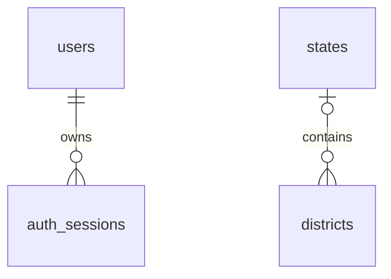

# Database structure

The following describes the four tables observed in local `shopping_db.public` on 2026-09-24 before the management feature was added. New mappings and the additive schema upgrade are described below. Generated [entity mappings](generated/entities.md) refresh from TypeScript automatically. Live schema drift must be checked separately; the generator does not connect to PostgreSQL.



District state_id is nullable in the actual schema, hence its optional parent. The importer always supplies a matched state.

## users

Owned by `auth.entities.ts`'s User; read by both auth and users modules.

| Column | PostgreSQL type | Null | Default / constraint | Meaning |
| --- | --- | --- | --- | --- |
| id | uuid | No | PK; uuid_generate_v4() observed locally | Stable account identifier |
| name | varchar(100) | No | None | Display name |
| email | varchar(254) | No | Unique | Login identity; API normalizes trim/lowercase |
| passwordHash | varchar | No | None; ORM select:false | Salt and scrypt result separated by colon |
| role | varchar | No | customer | Server-managed authorization role |
| createdAt | timestamp without time zone | No | now() | TypeORM creation timestamp |

Role's TypeScript union contains customer, superadmin, admin, state_admin, district_admin, vendor, vendor_admin, staff, and agent. PostgreSQL stores varchar, not an enum/check constraint; direct SQL can write other strings. Email uniqueness is case-sensitive at the database layer; API normalization is what makes normal registration case-insensitive. Direct writes must preserve that invariant. select:false affects ORM queries, not database permissions. Auth login explicitly selects the password hash.

## auth_sessions

Owned by AuthSession in the same entity file.

| Column | PostgreSQL type | Null | Constraint | Meaning |
| --- | --- | --- | --- | --- |
| tokenHash | varchar(64) | No | PK | SHA-256 hex digest of cookie token |
| userId | uuid | No | FK users(id), ON DELETE CASCADE | Account owning the session |
| expiresAt | timestamp with time zone | No | None | Absolute expiration |

Raw tokens are not stored. Multiple sessions per account are allowed. Deleting a user cascades to their sessions. There is no refresh-token table, renewal process, secondary expiry index, or built-in cleanup job. Expired rows are ignored by authentication but remain stored until removed.

## states

Provisioned separately from TypeORM; no backend entity or route exists.

| Column | Type | Null | Constraint |
| --- | --- | --- | --- |
| id | integer / serial | No | PK; states_id_seq default |
| name | varchar(100) | No | Unique |
| type | varchar(20) | No | CHECK: State or Union Territory |

## districts

| Column | Type | Null | Constraint |
| --- | --- | --- | --- |
| id | integer / serial | No | PK; districts_id_seq default |
| state_id | integer | Yes | FK states(id), ON DELETE CASCADE |
| name | varchar(100) | No | Composite UNIQUE(state_id, name) |

The local import produced 787 districts across 36 states/union territories. This records the imported source dataset; it does not certify current administrative geography. SQL uniqueness does not prevent multiple null-state pairs in the same way as non-null state pairs. Avoid inserting null state_id values.

## Naming and operational checks

Auth column names are camelCase, so SQL must quote them:

```sql
SELECT id, email, role, "createdAt" FROM public.users;
SELECT "userId", "expiresAt" FROM public.auth_sessions;
SELECT count(*) FROM public.districts;
SELECT count(*) FROM public.districts d
LEFT JOIN public.states s ON s.id = d.state_id WHERE s.id IS NULL;
```

Do not select password hashes or raw cookies for ordinary debugging. A viewer showing 100 rows may be paginating; COUNT(*) checks the actual count.

Development synchronization updates mapped tables when the backend starts. The management feature includes a manually applied additive SQL upgrade under apps/backend/src/database; there is no automated production migration runner. For future schema changes, document the migration, defaults, backfill, indexes, rollback implications, and frontend contract impact before deploying.

## Management additions

Users now also maps userType varchar(100) NOT NULL DEFAULT Customer; userTypeId UUID NULL; state/district varchar NULL; vendorId UUID NULL; active boolean NOT NULL DEFAULT true. userType labels all accounts; userTypeId identifies a custom staff permission record. Regional and vendor scope is checked by the service on every management request. Blocking an account invalidates authentication even for existing session rows.

The new management_records table holds vendor/type/category/field/product/order/audit rows. Its ownership columns, JSON payload schema, indexes, validation, logical relationships and transaction rules are detailed in [management tables](features/management.md). No new table has been assumed to exist from the older four-table observation. Integration tests create this table only in random test schemas.

`apps/backend/src/database/management-upgrade.sql` adds columns/table/indexes and backfills non-customer type labels transactionally. Review and apply before a synchronization-disabled deployment; development can synchronize on startup. Keep additive fields/table during an application rollback to preserve business data. The upgrade does not import geography or assign legacy vendor accounts to a business automatically.

User Type definitions now store role, permissions and protected in existing JSONB payloads; vendor approvals store approvedAt/approvedBy. Startup idempotently initializes default type records. No additional columns are required. Geography selectors validate canonical names against public.states/districts; assignments remain string columns. See [hierarchy](features/user-types.md) for legacy-type and pending-vendor handling.
