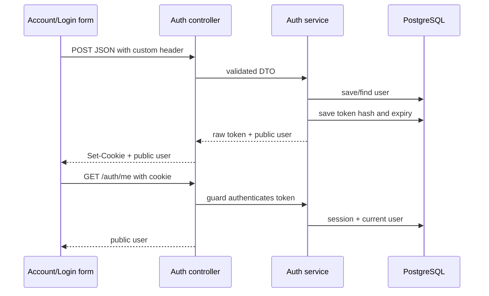

# Authentication feature

## Scope and files

This feature implements email/password customer registration, sign-in for existing roles, current-session lookup, and single-session logout.

| Source file | Responsibility |
| --- | --- |
| auth.entities.ts | User and AuthSession persistence mappings |
| auth.dto.ts | LoginDto and RegisterDto input validation/normalization |
| seed-superadmin.ts | Explicit local superadmin helper, never a public endpoint |
| auth.service.ts | Password verification, user creation, session persistence, public serialization |
| auth.controller.ts | Four HTTP endpoints and browser cookies |
| auth.guard.ts | Cookie parsing, AuthGuard, AdminGuard, request user typing |
| auth-security.middleware.ts | No-store header, origin/custom-header checks, per-IP throttling |
| auth.module.ts | Repository/provider registration, global exports, middleware binding |

Files live in `apps/backend/src/modules/auth`. Exact declarations are in the [backend file index](../generated/README.md).

## Tables

User maps to users; AuthSession maps to auth_sessions with a cascading user foreign key. See [column-by-column database documentation](../database.md). A session holds a hashed token, user ID, and absolute expiry. The browser receives the random token; the API returns only the public user projection.

## DTOs

| DTO / field | Transformation | Validation |
| --- | --- | --- |
| LoginDto.email | Trim, lowercase if string | Valid email; max 254 characters |
| LoginDto.password | None; whitespace remains significant | String, 1?128 characters |
| RegisterDto.email | Inherited | Same as login |
| RegisterDto.name | Trim if string | String, 1?100 characters |
| RegisterDto.password | Inherited string/max validation | Minimum strengthened to 12; maximum 128 |

The DTO uses inheritance to share email rules. The global validation pipe strips fields with no validation decorators; supplying role does not grant privileges. Service methods expect the normalized DTO supplied by HTTP validation; calling them directly bypasses those transformations.

## Service functions and methods

| Symbol | Inputs and result | Behavior / failure |
| --- | --- | --- |
| derive | password + salt ? Promise&lt;Buffer&gt; | Async scrypt; 64-byte key, N=32768, r=8, p=1, 64 MiB maxmem; rejects crypto errors |
| hashPassword | password to salt/hash string | Shared salted scrypt helper for registration and local admin seed |
| sessionHash | token ? 64-character hex | SHA-256 token lookup key |
| publicUser | User ? id/name/email/role | Explicit safe response projection |
| SESSION_MS | Constant | Eight hours |
| register | RegisterDto ? token + public user | Random 16-byte salt; save customer; create session; map PostgreSQL 23505 to 409 |
| login | LoginDto ? token + public user | Query email with explicit passwordHash selection; derive and compare; 401 for mismatch/unknown user |
| createSession (private) | User ? token + public user | Random 32-byte hex token; save only digest and absolute expiry |
| authenticate | cookie token ? public user | Require 64 lowercase hex characters; find unexpired session; load current user; otherwise 401 |
| logout | token ? void | Delete session by digest; missing session is harmless |

Unknown login emails still run scrypt against a dummy salt/hash to avoid skipping the expensive operation. This reduces a timing difference; it is not a claim of identical timing across every request. Digest equality uses timingSafeEqual after checking lengths.

Registration's two writes are not enclosed in one transaction. A created account may remain if session creation fails. Login always creates a new session, and replacing the browser cookie does not revoke older sessions. Expiry is fixed, not sliding.

## Controller actions

AuthController is mounted at /api/auth. register and login await the service, set the cookie using cookieOptions plus maxAge, and return only { user }. me returns request.user, which AuthGuard populated. logout deletes the current session, clears the matching cookie path/options, and returns 204. There is no AuthGuard on logout, allowing a signed-out or expired-session client to clear its cookie.

Cookie attributes and API errors are detailed in [API contracts](../api.md). A token is never included in the JSON response even though the service returns it internally.

## Guards and middleware

sessionToken splits the Cookie header at semicolons and finds shopping_session; absent values become an empty string. AuthGuard.canActivate awaits authenticate and attaches a public user. AdminGuard.canActivate accepts only admin and superadmin. These guards must run in that order.

allowedOrigins splits AUTH_ORIGINS on commas and trims empty entries. AuthSecurityMiddleware.use always sets Cache-Control: no-store for auth routes. For POSTs it requires the custom header and rejects a supplied Origin that is not allowed. Login/register attempts share a per-IP counter: 20 per 15 minutes, including validation failures and successful attempts. Expired map entries are removed on later login/register calls. A 10,000-key cap limits the map size. The map is process-local and resets on restart; it is not a distributed limiter.

The custom header prevents ordinary cross-origin HTML form submission from satisfying the auth request contract, while credentialed browser requests are constrained by CORS and Origin checks. This middleware is bound to AuthController only; future mutation controllers need an explicit protection decision.

## End-to-end flow

## Why this design

Database sessions make immediate logout revocation and role lookup straightforward. HttpOnly cookies keep tokens out of normal frontend JavaScript storage. Salted scrypt supplies password hashing through Node's built-in crypto module. SHA-256 is appropriate here for indexing random high-entropy session tokens, not for password storage. Public registration forces customer to prevent privilege selection. Separate guards distinguish identity from permission.

Tradeoffs include a database lookup per protected request, no refresh/sliding session support, process-local throttling, and currently duplicated frontend clients. [Design decisions](../../design-decisions.md) records the wider rationale.

## Validation and future changes

auth.e2e-spec.ts covers public/guarded access, hostile auth requests, validation and role stripping, hash storage, duplicate email, current session, wrong/unknown passwords, expiry, admin role assignment, logout, and request limiting. Tests run against an isolated random schema.

When changing this feature, review database fields, DTO inheritance, response projection, cookie attributes, both frontend services, admin guards, the API guide, and expiry tests together. Password reset, email verification, MFA, and all-session revocation remain unimplemented.

## Local administrator provisioning

An explicit seed command can create a local superadmin using environment settings. It never runs automatically, resets an existing account, or promotes a customer. [Superadmin setup](superadmin-setup.md) documents the command, validation, and tests. Customer registration still always creates customer.
